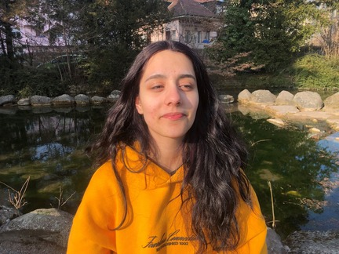

+++
title = "Drogenkonsum in der Jugend Interview"
date = "2023-03-16"
draft = false
pinned = false
tags = ["Suchtmittel", "Drogenkonsum", "Interview"]
image = "shayenne-1-2-.jpg"
description = "Ich habe jemanden, der mit persönlich unter Drogenkonsum leidet, interviewt. \nWie kommt es so weit? Was sind Auslöser und Schwierigkeiten? Hier ist ein Einblick in illegalen Suchtmitteln und deren Effekte."
+++



Sayenne Tuma ist in Frinvillier geboren und aufgewachsen. Sie hatte eine schwierige Kindheit hinter sich und lebt nun momentan in Zürich. Trotz Schwierigkeiten schliesst sie bald ihre Lehre im Detailhandel ab. Sie ist in ihrem Leben oft in Kontakt mit illegalen Suchtmittel gekommen, die sie und ihr Umfeld negativ beeinflussen. 



##### Wann bist du das erste Mal in Kontakt mit Drogen bekommen?

> Also um ehrlich zu sein bin ich mit Leuten um mich aufgewachsen, die Drogen nehmen. Eigentlich von Geburt an.

##### Was für Drogen hast du schon genommen? Planst du mehr zu nehmen? Welche?

> Also eigentlich nicht so viel. Ich habe einfach Ecstasy mal probiert, Gras und auch Hasch geraucht. Sonst eigentlich nichts.

##### Wie ist dein Umfeld? Kennst du viele Leute, die Drogen konsumieren?

> Ich kenne sehr viele Leute die Drogen nehmen. Du wärst erstaunt, wie viele Leute um dich Drogen nehmen, obwohl du denkst das du sie kennst.

##### Aus welchen Gründen hast du angefangen?

> Es hatte nicht einen richtigen Grund. Es ist einfach so dass Menschen um mich herum es gemacht haben und irgendwann habe ich mit Kollegen überlegt, dass es ja nicht so schlimm sein kann, wenn es alle um uns herum das auch machen. Probieren wir es auch mal aus.

##### Hast du schon versucht aufzuhören?

> Ich habe schon öfters versucht aufzuhören, aber momentan bin ich schon eine Weile nüchtern. 
>
> Es ist anstrengend und man braucht Selbstdisziplin, also wenn du aufhören willst und du trotzdem mit den Leuten abhängst, die es weiterhin machen ist es heikel, aber wenn sie auch aufhören, dann kann man das eigentlich relativ gut durchziehen. Man kann sich somit nämlich gegenseitig supporten.

##### Was hat es für Auswirkungen auf dich und/oder dein Umfeld?

> Ich meine es hat einen Grund, dass Drogen illegal sind. 
>
> Es beeinflusst dein Leben auf eine nicht sehr angenehme Art. 
>
> Zum Beispiel mache ich eine Lehre und ich habe angefangen zu schwänzen, ich hab mich immer wieder krankgemeldet, weil ich keine Motivation gehabt habe oder immer noch high vom Vorabend gewesen bin und gewusst habe das ich nicht aufstehen kann. Auch das man mich sowieso so nicht brauchen konnte solche dinge halt. 
>
> Wenn möglich nicht solche Sachen anfassen, bitte.

##### Ist der Zugang zu illegalen Drogen einfach? Was ist deine Meinung dazu?

> Du wärst erstaunt, wie einfach es ist. Man kann gefühlt immer und überall ein Gramm Gras oder irgend etwas in der Richtung finden. Es ist extrem einfach und es hat so viele Leute, die verkaufen. 
>
> Allein in dieser Stadt hier, ich könnte dir so eine grosse Auswahl von Leuten angeben, du wärst erstaunt.

##### Was würdest du Leuten sagen, die selber Drogen nehmen oder jemanden kennen?

> Wie gesagt, wenn möglich nie anfassen und auch wenn man Leute in Serien sieht, die so etwas nehmen und sich dann denkt "Oh mein Gott, so cool" es ist nicht cool. Du hast vielleicht für einen kurzen Moment ein gutes Gefühl, aber schlussendlich sind es immer noch Drogen und sie sind nicht gut.
>
> Am besten aufhören oder gar nicht erst anfangen.

##### Wenige Zeit nach dem Interview raucht ein Mann, nicht weit von uns entfernt, Marihuana. Währenddessen sind nicht weit von uns entfernt mehrere Familien mit Kindern, die spielen.



Sayenne Tuma ist in Frinvillier geboren und aufgewachsen. Sie hatte eine schwierige Kindheit hinter sich und lebt nun momentan in Zürich. Trotz Schwierigkeiten schliesst sie bald ihre Lehre im Detailhandel ab. Sie ist in ihrem Leben oft in Kontakt mit illegalen Suchtmittel gekommen, die sie und ihr Umfeld negativ beeinflussen. 

